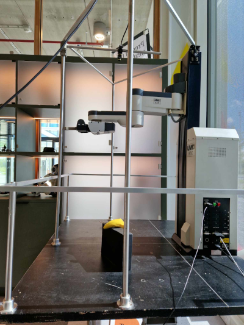
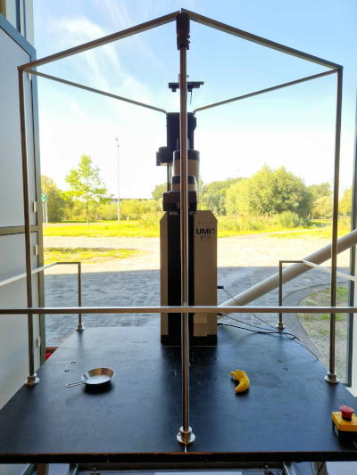
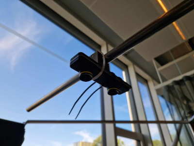
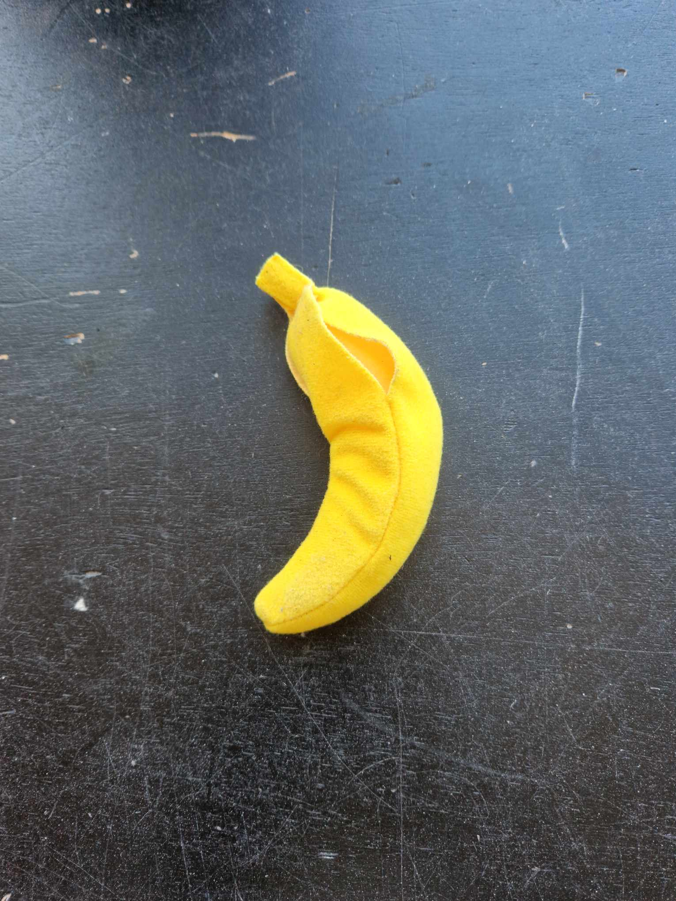

# ROS2 Interface for the UMI-RTX Arm

### Autors
* GARDE Guillaume (Promotion [_ENSTA Bretagne_](https://www.ensta-bretagne.fr) 2024 - Spécialité Robotique Autonome).
* MASSA Théo (Promotion [_ENSTA Bretagne_](https://www.ensta-bretagne.fr) 2024 - Spécialité Robotique Autonome).

This project was made during an internship at the [_University of Amsterdam_](https://www.uva.nl/en) under the supervision of Arnoud Visser PhD.

# Table of Contents

- [Description](#description)
- [Documentation](#documentation)
- [Configuration](#configuration)
- [Requirements](#requirements)
- [Usage](#usage)
    - [Build the package](#build-the-package)
    - [Testing](#testing)
    - [Real Arm](#real-arm)
    - [Simulation](#simulation)
    - [Docker](#docker)
        - [Installation](#installation)
        - [Usage](#usage-1)
- [Demonstration](#demonstration)

### Description

This repository provides tools to set up a ROS 2 interface for controlling the UMI-RTX robotic arm.
The mission of this project is to make the arm detect a target (we chose a banana plush) via computer vision and then move to grab it and lift it.
The different nodes of the ROS architecture correspond to:
* inverse kinematics
* arm control 
* computer vision
* simulation
* custom Graphic User Interface (GUI)

A vast majority of this project's code (the one we wrote) is in C++.

### Documentation
A documentation of the code can be found in [/ROS_ws/doc/](/ROS_ws/doc/). To open the doc in html, just launch *index.html*.

You can find the original drivers in [/umi-rtx](/umi-rtx) or on this [repository](https://github.com/physar/umi-rtx)

### Configuration
This project is built and tested with **Ubuntu 20.04** and **ROS2 Foxy**. In case these settings are not supported, see [this part](#docker).

Used material in this project:
* A UMI-RTX robotic arm

  

* A Stereolabs [_ZED Mini_](https://www.stereolabs.com/zed-mini/) stereo camera and its cable
    
  

* A standard banana plush

  

* An Intel Core i9 processor and a Nvidia GPU (Geforce **RTX**)

**Note**: The ZED Mini cable needs to be plugged into the device with its incurved arrows on the same side as the lenses.

### Requirements
The computer vision node uses _OpenCV_ and [Stereolabs](https://www.stereolabs.com/)' Software Development Kit (SDK).
To use the SDK, a powerful [_Nvidia_](https://www.nvidia.com/fr-fr/) Graphics Processing Unit (GPU) is required. See [here](https://docs.nvidia.com/cuda/cuda-installation-guide-linux/index.html#system-requirements) for a compatibility check and installation.

**Note**: Two versions of the computer vision node are provided here but only one will be launched. This version uses
the SDK and _OpenCV_. The other version is the first we wrote and only uses _OpenCV_.
However, it is not performant enough and gives bad results.

If you plan not to use [Docker](#docker), you need to download and install the SDK as well as Nvidia drivers.
See [here](https://www.stereolabs.com/docs/installation/linux/) to install the SDK on Linux. If you followed all the steps, the Nvidia drivers should be installed.

### Usage
#### Build the package
In order to use the interface, you will need to build the ROS 2 package (don't forget to source ROS 2 beforehand).

    ## install the required dependencies
    ./install_dependencies.sh
    cd ROS_ws
    ## Build the package
    colcon build

If you are on bash:

    source install/setup.bash
    
If you are on zsh:

    source install/setup.zsh

#### Testing
To test the computer vision node separatly, follow the commands below:

    ros2 run ros_interface_umi_rtx nodeCameraAPI

Once the node is running, you can interact with its output thanks to diverses tools like [RQt](https://docs.ros.org/en/foxy/Concepts/About-RQt.html) or RViz.

#### Real arm
To use the interface, all you have to do is :

    cd LAB42_RTX_control
    ## Launch the arm
    ./start_arm

The custom GUI will launch in the same time as the arm

If you want to monitor the nodes and topics or interact with them, all you have to do is logging as root:

    sudo -i

And then sourcing ROS:

    source /opt/ros/foxy/setup.bash

#### Simulation
In order to start only the simulation, just run:

    ros2 launch ros_interface_umi_rtx simu.launch.py

### Docker
As told earlier, this project works under Ubuntu 20.04 and ROS2 Foxy. However, the usage of the interface is not limited to this configuration thanks to a custom Docker image that allows to use our interface with a different configuration.

#### Installation
The only requirements are to have Docker installed on your computer (see [here](https://docs.docker.com/get-docker/) to install Docker), to have a NVIDIA GPU with the necessary drivers for which the installation process is described [earlier](#requirements), and having installed the [nvidia-docker-toolkit](https://github.com/NVIDIA/nvidia-docker). 

    distribution=$(. /etc/os-release;echo $ID$VERSION_ID)
    curl -s -L https://nvidia.github.io/nvidia-docker/gpgkey | sudo apt-key add -
    curl -s -L https://nvidia.github.io/nvidia-docker/$distribution/nvidia-docker.list | sudo tee /etc/apt/sources.list.d/nvidia-docker.list

    sudo apt-get update && sudo apt-get install -y nvidia-docker2 nvidia-container-toolkit
    sudo systemctl daemon-reload
    sudo systemctl restart docker

Once this is done, you can build the docker image with the command:

    # Place yourself in LAB42_RTX_CONTROL
    docker build -t "name" .

Be careful to replace "name" with the name you want, and everything is ready !
#### Usage
To run our image into a container, run :

    # Give the permission to use the screen
    xhost +

    # Launch the container (replace "name" with the name you chose)
    docker run --gpus all -it --privileged -e DISPLAY=$DISPLAY -v \\
                /tmp/.X11-unix:/tmp/.X11-unix --rm "name":latest

Once the container is running, the process is similar as the one descibed [here](#usage)

    cd ROS_ws/
    colcon build
    source install/setup.bash
    cd ..

If you want to use the arm, do

    ./start_arm.sh

If you want to launch only the simulation, do

    ros2 launch ros_interace_umi_rtx simu.launch.py

### Demonstration
[Here](https://www.youtube.com/playlist?list=PLr7kwtXen7-Se0UGnNa_Y2hR0W9sA3iEf) is a link to a Youtube playlist where you can find some trials and demonstration of the interface.
