Stereo Camera Calibration
==========================

The relative positions of left and right cameras can slightly change over time. In such cases, the factory calibration data for a ZED camera cannot be used and it is needed to recalibrate the ZED camera to update camera parameters and stereo rectification tables. For this purpose, we provide three OpenCV based python scripts. Note that these scripts are running on Ubuntu PC. Even though these scripts are tested with ZED camera only, they can be used for the calibration of stereo cameras other than ZED with minor changes if needed.

## Stereo Camera Capture

Multiple stereo images should be captured with a checkerboard using stereo_capture.py.

```
usage: python3 stereo_capture.py [-h] [-p PATH] [-m CAM_MODE] [-d DEV_NUM]

optional arguments:
    -h, --help                    Show this help message and exit.
    -p PATH, --path PATH          Path to the directory where snapshots will be stored for calibration.
                                  Left and right images are saved in PATH/imageL and PATH/imageR, respectively.
    -m CAMMODE, --mode CAMMODE    Camera mode. FHD, FHD2, HD and VGA are supported. FHD2 is 1920x1024, which is cropped from FHD.
    -d DEVNUM, --device DEVNUM     Device number, e.g., 0 for /dev/video0, 2 for /dev/video2.
```

9x7 checkerboard chart is recommended. The checker board chart can be downloaded from [calib.io](https://calib.io). Multiple snapshots more than 20 are required to guarantee a good calibration. The checkerboard chart must be presented in various poses, covering as many locations within the field of view and at different distances from the camera. The camera must remain at the same position throughout the snapshots, only the checkerboard can be moved around. Place the checkerboard at different positions within the field of view and at different distances from the camera. Avoid poses in which the checkerboard angle is too close to 90 degrees.

The figures below show what would be considered as good or bad poses.

<!-- <p align="center">
    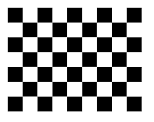
    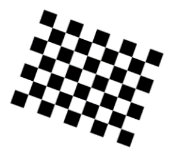
    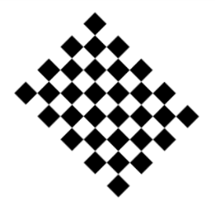
    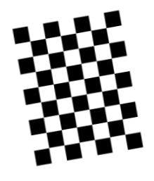
    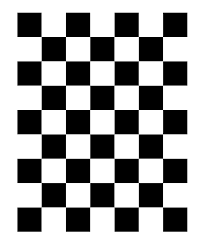
</p> -->
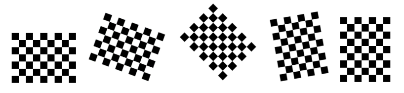
<figcaption>Figure 1. Good or Bad checkerboard poses: From left to right, good, good, fair, bad and bad.</figcaption>
<br />

Once we launch stereo_capture.py, both left and right image sequences will show up in the same window. To save each image snapshot, press '**s**' while a mouse is over the image window. Left and right images will be saved in `PATH/imageL` and `PATH/imageR`, respectively, where PATH is the directory specified when launched. After capturing all the images, press '**q**' to exit. The following figures shows the examples of checkerboard snapshots.

<!-- <p align="center">
     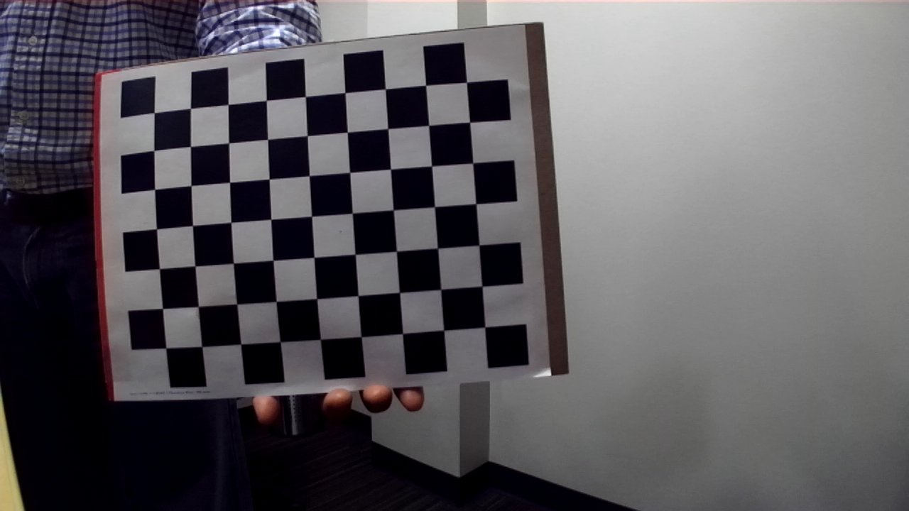
    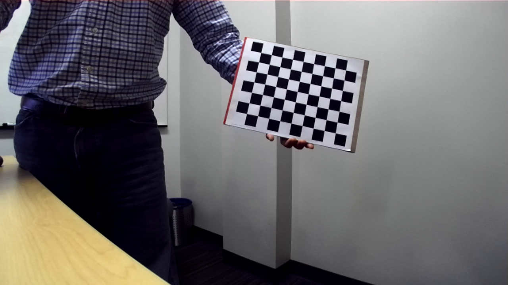 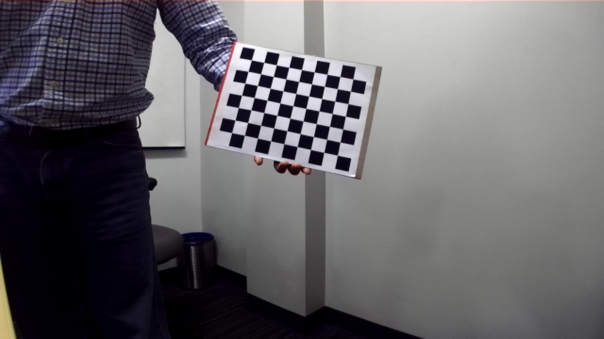
    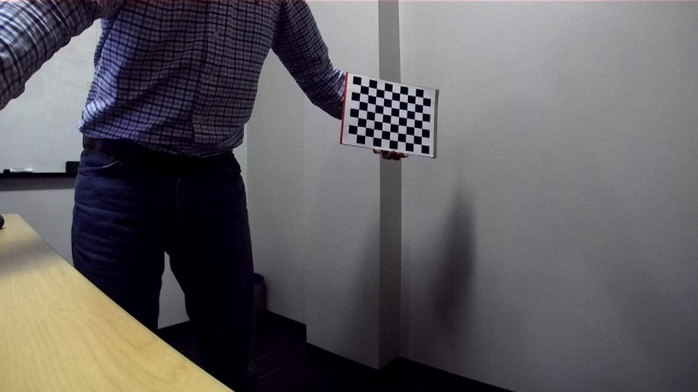 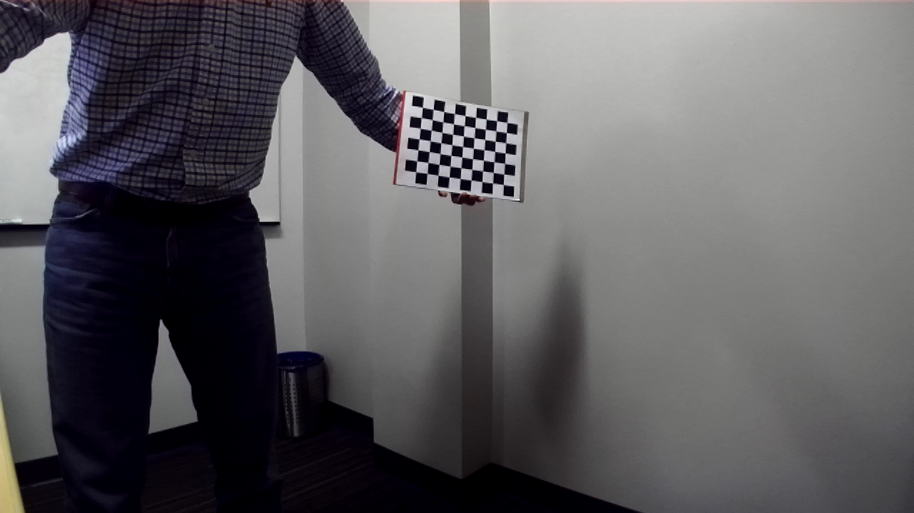
    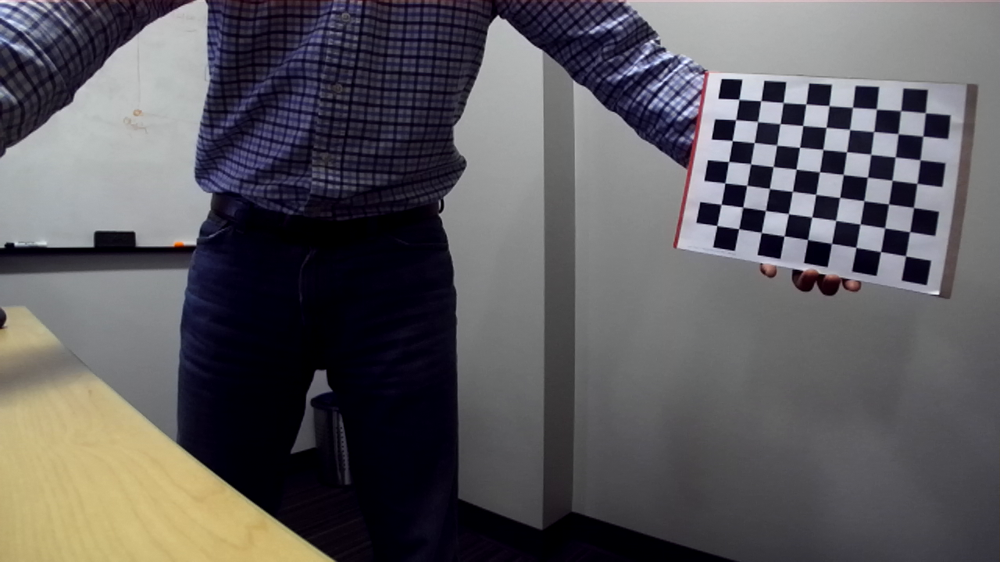 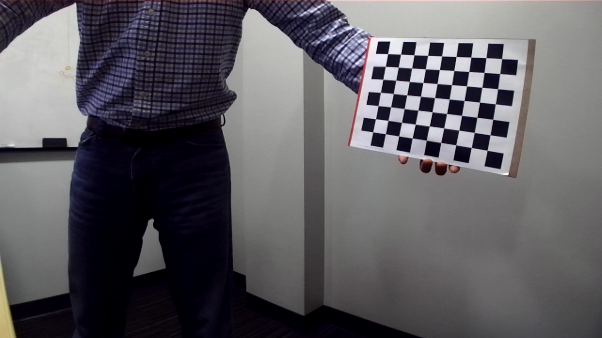
     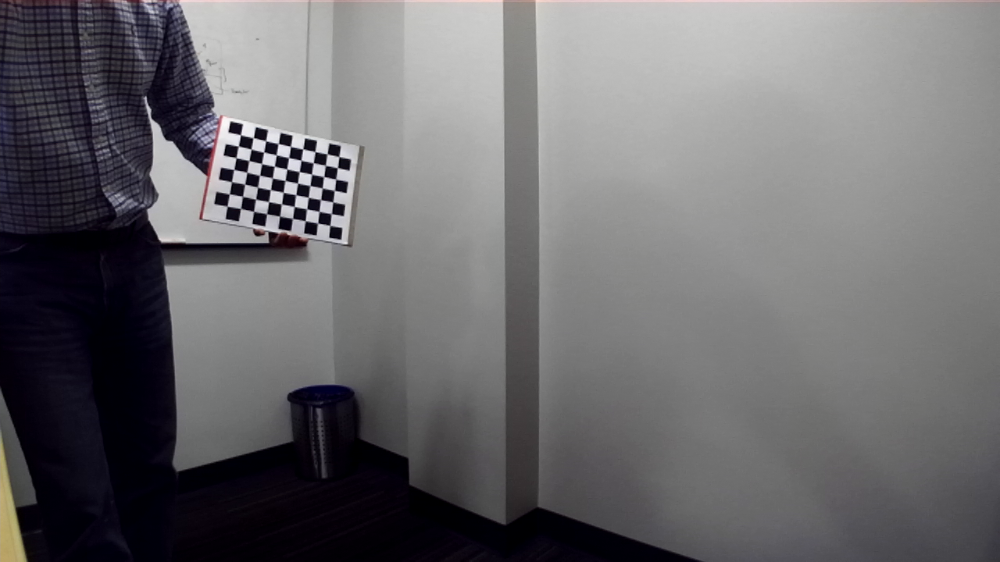
</p> -->

<figcaption>Figure 2. Examples of checkerboard snapshots.</figcaption>
<br />

## Stereo Camera Calibration

With multiple stereo images with the checkerboard chart, we can now ready to run stereo camera calibration.

```
usage: python3 stereo_calibration.py [-h] [-p PATH] [-m CAM_MODE] [-w WIDTH] [-h HEIGHT] [-s SIZE]

optional arguments:
    -h, --help                    Show this help message and exit.
    -p PATH, --path PATH          Path to the directory where snapshots are stored for calibration.
                                  Left and right images are saved in PATH/imageL and PATH/imageR, respectively.
    -m CAMMODE, --mode CAMMODE    Camera mode. FHD, FHD2, HD and VGA are supported. FHD2 is 1920x1024, which is cropped from FHD.
    -c COLUMN, --column COLUMN    Checkerboard width in terms of the number of control points
    -r ROW, --row ROW             Checkerboard height in terms of the number of control points
    -s SIZE, --size SIZE          Checkerboard grid size in mm
```

It first detects the corner points from all left and right images saved. The figures below shows the detected corner points from the left and right pairs. It is not always successful to detect the corner points from all images. It fails sometimes for some images. Even though all the control points are detected from a left and right pair, the order of the corner points may not be correct. Considering the errors in the corner point detection, it is recommend to save 3 or 4 more stereo image pairs when capturing snapshots with stereo_capture.py.

<!-- <p align="center">
    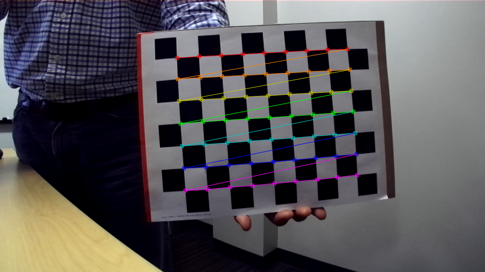 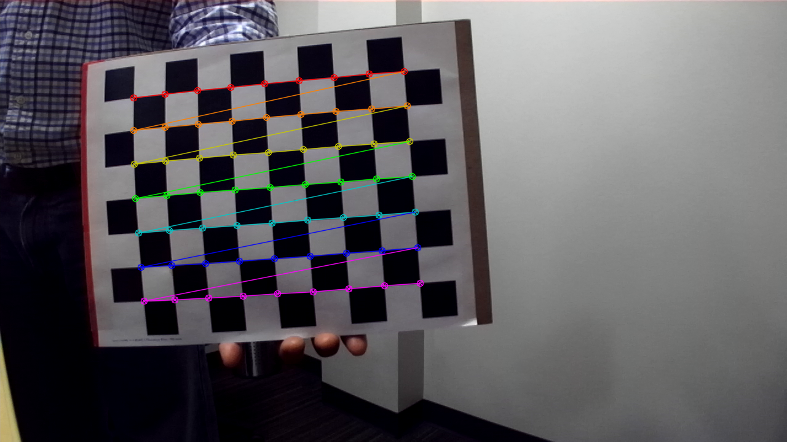
     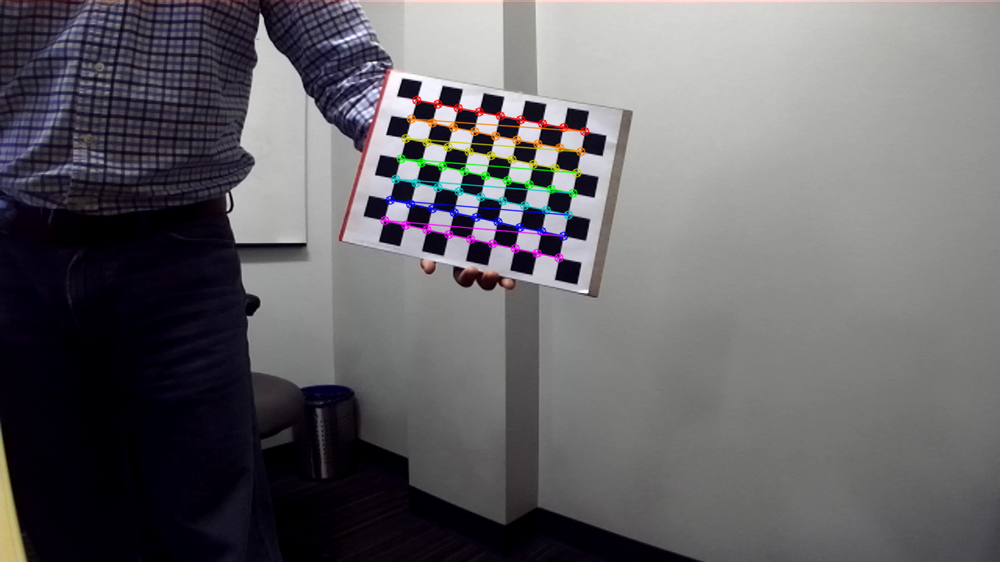
     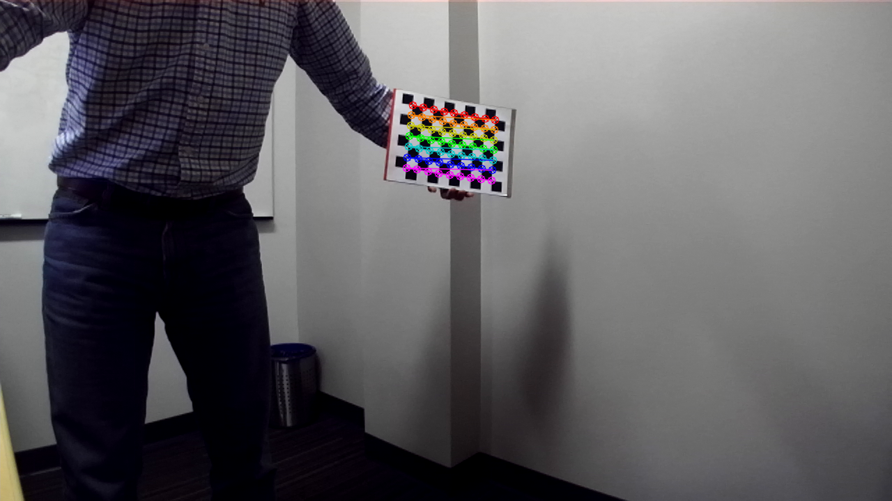
     
    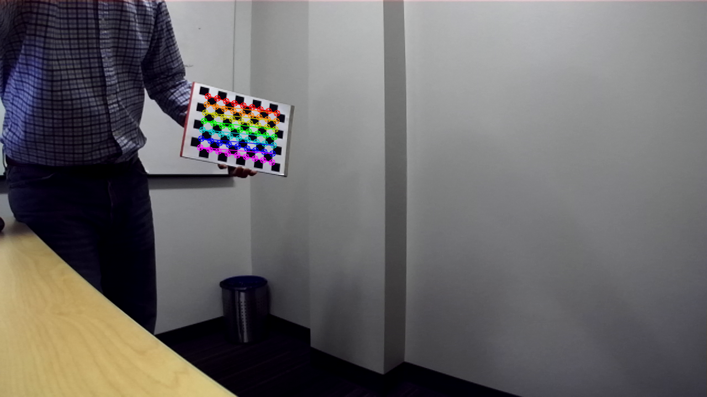 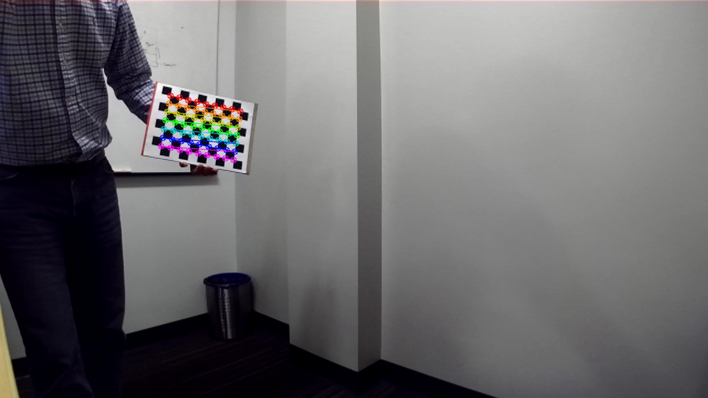
</p> -->
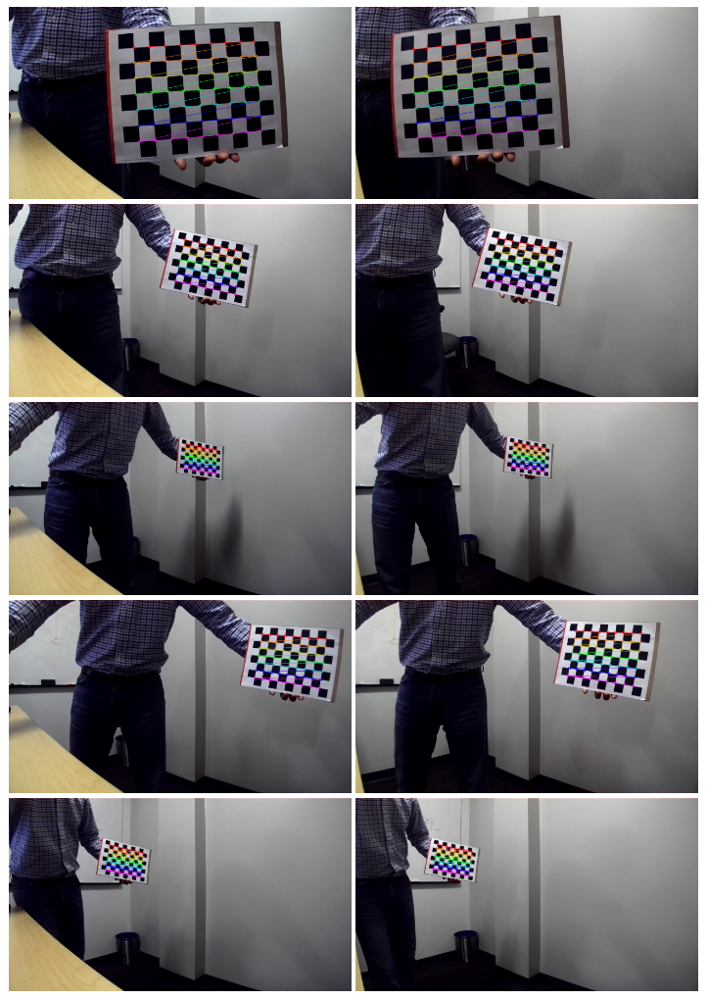
<figcaption>Figure 3. Detected corner points.</figcaption>
<br />

After detecting the corner points from all images, the camera calibration for left and right images and the stereo rectification are performed. After the calibration, it does the followings:

1. Prints the calibration errors, e.g.,
```
============================
Calibration RMS error
Left   = 0.42999868487598675
Right  = 0.45839071430768813
Stereo = 0.39342797821643921
============================
```
If one of errors is larger than 1.0, it is recommended to do calibration again. There are a couple of main reasons that cause high RMS error. First of all, it should be confirmed that the checkerboard were placed at various distances from camera and various positions. Otherwise, it is recommend to capture stereo images again. Second, it should be confirmed checked that the order of detected corner points are right. Such images are detected and discarded after the corner point detection. But there could be such images remaining. For the stereo depth engine (SDE), the RMS error less than 0.5 is recommended

2. Create camera info YAML files for left and right cameras, e.g.,  `custom_CAMMODE_camera_info_left.yaml` and `custom_CAMMODE_camera_info_right.yaml`, and save them in the `zed_capture/config` directory.

3. Create LDC look-up-tables for left adn right cameras, e.g., `custom_CAMMODE_LUT_left.bin` and `custom_CAMMODE_LUT_right.bin`, and save them in the `zed_capture/config` directory. These tables can be used for the SDE application on J7.

4. Create a stereo remap table, `stereoMap.xml` in the format that the OpenCV rectification can read, and save it in the `PATH` directory, which is one specified when launched.

## Stereo Camera Calibration Test

The stereo calibration can be tested on the Ubuntu PC before testiing on J7.

```
usage: python3 stereo_test.py [-h] [-p PATH] [-m CAM_MODE] [-d DEV_NUM]

optional arguments:
    -h, --help                    Show this help message and exit.
    -p PATH, --path PATH          Path to the directory where snapshots will be stored for calibration.
                                  Left and right images are saved in PATH/imageL and PATH/imageR, respectively.
    -m CAMMODE, --mode CAMMODE    Camera mode. FHD, FHD2, HD and VGA are supported. FHD2 is 1920x1024, which is cropped from FHD.
    -d DEVNUM, --device DEVNUM    Device number, e.g., 0 for /dev/video0, 2 for /dev/video2.
```

It reads `PATH/stereoMap.xml`, where `PATH` is the directory specified when launched to rectify raw inputs from left and right cameras. Then, as shown in Figure 4, it displays the rectified left and right sequences with overlaid horizontal lines to help visual evaluation. Based on it, we can determine whether the stereo camera should be calibrated again.

<!-- <p align="center">
    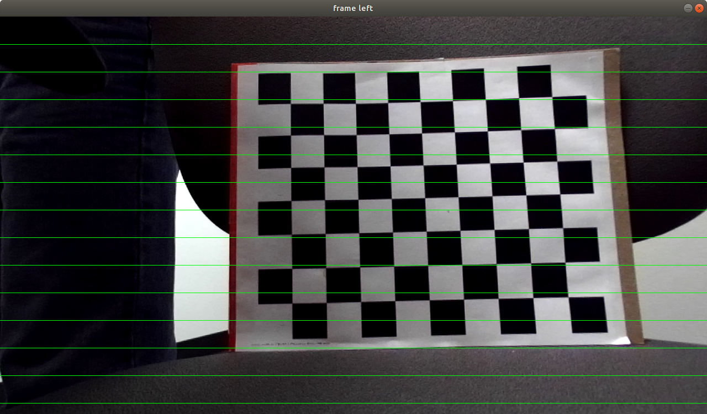 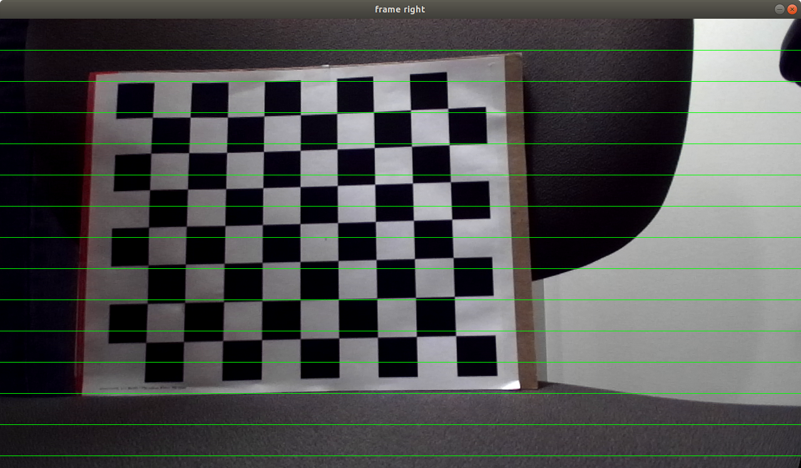
</p> -->
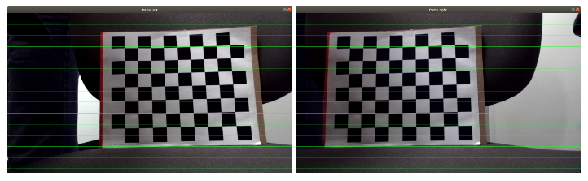
<figcaption>Figure 4. Rectified left and right images</figcaption>
